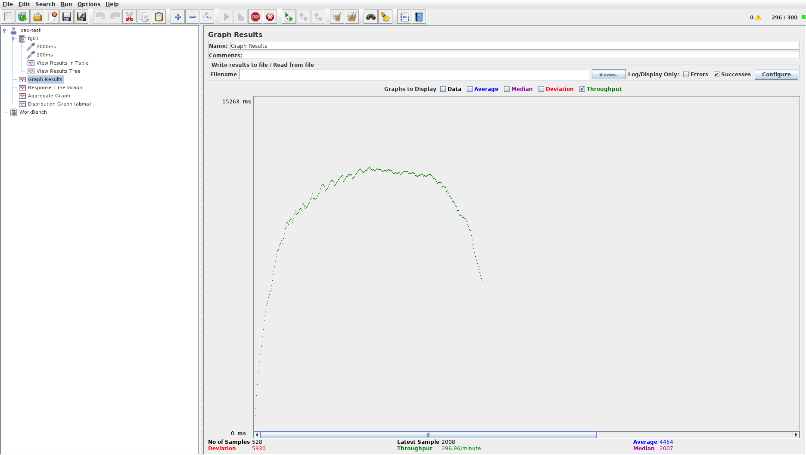
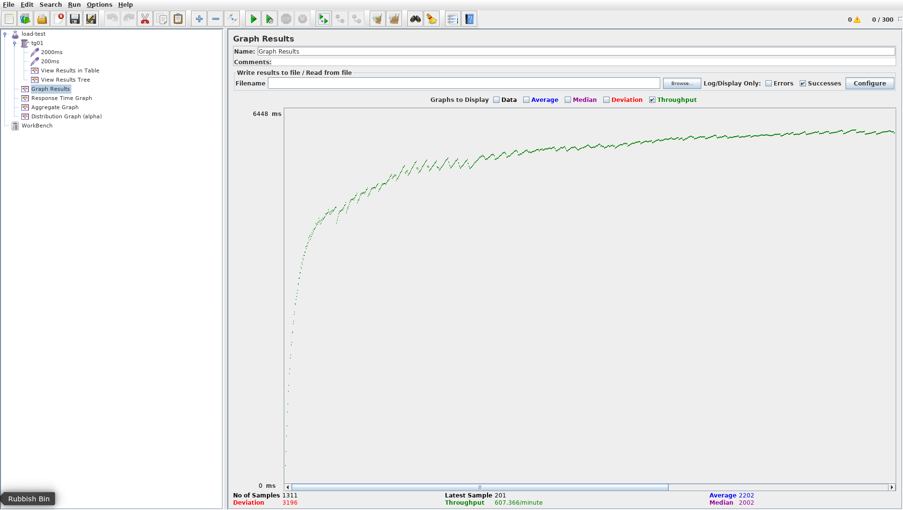

# OpenTable Server Component


The OpenTable Java Server component is the main code entry point into the OpenTable Java (OTJ) stack. It provides a customized Spring Boot set up. The customizations are numerous and include:

 * Graceful shutdown
 * Jetty HTTP server
 * OT Conserved Headers
 * `otj-metrics` integration
 * `otj-jackson` integration
 * JVM pause detector
 * JMX monitoring and management
 * Static resource serving over HTTP
 * Logging configuration

## Flavors

There are 2 flavors of OTJ Server available:
 * **MVC** - this uses Spring's Model View Controller (MVC) framework to create web services. For a REST client with this flavor, we recommend otj-rest-template.
 * **Reactive** - this uses Spring's WebFlux reactive framework to create reactive web services. For a REST client with this flavor, we recommend otj-webclient.
 
## Differences Between Flavors

For the most part we expect the servers to act the same. One difference is how we handle CORS headers. In the formerly supported JAX-RS we sent CORS headers for all requests. In Spring MVC and WebFlux you need to add a `@CrossOrigin` header to the controller when needed.

### Modules

There are 3 modules in this project, the core module is for code shared in common between both flavors.

## Getting Started

Much like Spring boot, you need to create an Application or Main class. There are examples below. You can also use our Maven archetype to create a new project from our template, see https://wiki.otcorp.opentable.com/display/PA/Create+a+New+Project+from+an+Archetype for more information.

## Examples

We have examples projects that show how to use server:
 - https://github.com/opentable/reactive-demo (reactive)
 - https://github.com/opentable/service-otj-mvc-demo (Spring MVC)

### Spring MVC Example

```java
package com.opentable.demo;

import org.springframework.context.annotation.Bean;
import org.springframework.context.annotation.ComponentScan;
import org.springframework.context.annotation.Configuration;

import com.opentable.server.MVCServer;
import com.opentable.server.OTApplication;
import com.opentable.service.ServiceInfo;
import com.opentable.service.discovery.client.EnableDiscoveryClient;

@Configuration
@MVCServer // Configures the server with Spring MVC
@EnableDiscoveryClient // Enable the discovery client
@ComponentScan // Enable component scanning
public class DemoServerMain {

    /**
     * Standard Java entry point.  Almost all of the real work is done in the
     * {@link MVCServer}.
     */
    public static void main(String[] args)
    {
        OTApplication.run(DemoServerMain.class, args); // Starts the application, equivalent to SpringApplication
    }

    @Bean
    public ServiceInfo serviceInfo() {
        return new ServiceInfo() {
            @Override
            public String getName() {
                return "otj-mvc-demo"; // used for discovery name, metrics, etc.
            }
        };
    }
}
```


### Spring WebFlux Reactive Example
```java
package com.opentable.reactivedemo;
 
import org.springframework.beans.factory.annotation.Value;
import org.springframework.context.annotation.Bean;
import org.springframework.context.annotation.Configuration;
 
import com.opentable.server.OTApplication;
import com.opentable.server.reactive.ReactiveServer;
import com.opentable.service.ServiceInfo;
import com.opentable.service.discovery.client.EnableDiscoveryClient;
 
@Configuration
@ReactiveServer
@EnableDiscoveryClient
public class ReactiveDemoApplication {
 
    @Value("${ot.service.name:service-reactive-demo}")
    private String serviceName;
 
    public static void main(String[] args) {
        OTApplication.run(ReactiveDemoApplication.class, args);
    }
 
    @Bean
    public ServiceInfo serviceInfo() {
        return () -> serviceName;
    }
}
```

## Server Main Class

`otj-server` provides [OTApplication](https://github.com/opentable/otj-server/blob/master/server/src/main/java/com/opentable/server/OTApplication.java)
which does our initialization and then invokes `SpringApplication.run` to actually boot the service.

The `@MVCServer`, `@ReactiveServer` annotations provide the basic necessities for running a web service:


### Jetty Configuration

We setup an embedded Jetty servlet container with many customizations like graceful shutdown and additional HTTPS connectors with a custom keystore. We also instrument the container and report metrics from it.

These customizations are not possible to do using just Spring Boot. We are monitoring Spring Boot and if it changes we will switch to use Spring Boot directly when possible.

Here are a couple of the Spring Boot issues we are tracking:
[Issue #4657](https://github.com/spring-projects/spring-boot/issues/4657)
[Issue #5314](https://github.com/spring-projects/spring-boot/issues/5314)

`ot.httpserver.max-request-header-size` controls the header size. It defaults to 16384

### Named HTTP Connectors

We add support for declaring named connectors in configuration, and then choosing from those as a set of active connectors.

Each connector has properties `port`, `protocol`, `forceSecure`, `keystore`, and `keystorePassword`.

`port` defaults to `-1`, which indicates to take the next port injected via
[PORT0, PORT1, ...].  `0` means to assign any available port.  Any positive
number requests that port literally.

Note: This logic changes somewhat in otj-server 3.1.0 (See Port Selector notes)

Note that currently it is your responsibility to ensure the number of assigned
ports meshes with your configuration of e.g. JMX port.  We might improve this in the future.

`protocol` should be one of `http`, `https`, `proxy+http`, or `proxy+https`.

`forceSecure` should be set on connectors that are *not already secure* (i.e., never on a `https` connector)
but are terminated securely elsewhere.  You might use this if F5 terminates SSL in front of Frontdoor, for example.

`keystore` declares a path to a Java keystore to use for SSL.

```
# first, declare all your connectors
## default-http is usually on $PORT0
ot.httpserver.connector.default-http.port=-1
## you could declare a fixed-http connector, this is useful to e.g. connect direct to ELB
## but it'll cause deployment problems - usually you'd only do this in development
ot.httpserver.connector.fixed-http.port=8080
## and maybe you want to secure some things with TLS
## port defaults to -1 so this will get $PORT1
ot.httpserver.connector.my-https.protocol=https              # this connector is https
ot.httpserver.connector.my-https.keystore=/some/keystore.jks # and has these keys loaded

# activate connectors.  connectors declared but not referenced here are inactive
# particularly note that default-http needs to be here if you want it active
ot.httpserver.active-connectors=default-http,fixed-http,my-https
```

The `default-http` connector is hard-wired to Spring Boot's default connector and is less customizable;
the rest are created by the `otj-server` code and wired to Jetty ourselves.

The `boot` connector is the same as the  `default-http` connector, but it takes its host and port from Spring Boot's default connector.

## Configuration

Previous versions of `otj-server` had a configurable `ot.http.bind-port`; this usually would be replaced with e.g.
```
ot.httpserver.connector.default-http.port=8080
```

Usually the defaults are okay.  You might tune your thread pool size for heavily utilized services.  See more detail on the wiki, under [Jetty HTTP Server](https://wiki.otcorp.opentable.com/display/CP/Jetty+HTTP+Server#JettyHTTPServer-ThreadPoolUsage).

```
ot.httpserver.max-threads=32
```

## Backend Info 

For historical reasons, and debugging (and some applications and checks depend on it), `otj-server` wires in a servlet/reactive filter that
exposes information such the backend host, instance number, jar, etc in the HTTP Response.

This is a **security** flaw if leaked to the outside world. Frontdoor includes code to strip this, but it's easy to imagine holes opening:

* Another proxy copies them
* You aren't connecting via Frontdoor

To suppress this behavior use `ot.server.backend.info.enabled=false`

### JMX Configuration

```
ot.jmx.port=12345
ot.jmx.address=127.0.0.1
ot.jmx.url-format=service:jmx:jmxmp://%s:%s
```

### Port selector notes (otj-server 3.1.0+)
* The ordinally named ports PORT0, PORT1, PORT2 have always been problematic, since different folks use different numbers, and standardization
is difficult. Kubernetes adds named ports like PORT_JMX, PORT_ACTUATOR, etc, which are preferable. (You must
bind the ports in your Helm values file, we recommend http, jmx, actuator in that order for all Java projects

* We therefore changed a lot of innards and logic. Below we describe how ports are assigned in Kubernetes
and Singularity. Specifically we are talking about http ports (both otj server and boot), jmx, and actuator
(aka management.server.port)

_Singularity_

| Property name | Purpose | How it's set |
| ------------- | ------- | ------------- |
| server.port  | Default Spring Boot connector, also known as "boot" in connector list. Rarely used | Check if the Spring Property is set, if so use it. Otherwise allocate one of the existing PORTn automatically, logging if none are available. Finally fall back to 8080. |
| ot.httpserver.connector.default-http.port | The default otj http server connector | Check if the Spring Property is set, if so use it. Otherwise allocate one of the existing PORTn automatically, logging if none are available. Finally fall back to 0, which disables. |
| ot.httpserver.connector.${name}.port | Additional named connectors | The default otj http server connector | Check if the Spring Property is set, if so use it. Otherwise allocate one of the existing PORTn automatically, logging if none are available. Finally fall back to 0, which disables. |
| ot.jmx.port | JMX (programmatic) | Check if the Spring Property is set, if so use it. Otherwise allocate one of the existing PORTn automatically, logging if none are available. Finally fall back to 0, which disables. |
| server.management.port | Actuator | Check if the Spring Property is set, if so use it. Otherwise allocate one of the existing PORTn automatically, logging if none are available. Finally fall back to null, which disables. |

The only small difference here is the ordering might change from pre otj-server 3.1.0. We don't expect this to
be a huge deal, and the selected ports are logged prominently. Also if you are using JPDA (remote debugging), you may
have to allocate two additional ports, since the actuator will grab the first additional port)

```
020-05-04T22:44:33.807Z DEBUG <> [main] com.opentable.server.PortSelector - Allocated PORT0 for ot.httpserver.connector.default-http.port
2020-05-04T22:44:33.808Z DEBUG <> [main] com.opentable.server.PortSelector - Allocated PORT1 for ot.jmx.port
2020-05-04T22:44:33.808Z DEBUG <> [main] com.opentable.server.PortSelector - Allocated PORT2 for management.server.port
2020-05-04T22:44:33.809Z INFO  <> [main] c.o.s.SpringPortSelectionPostProcessor -
Port Selections:
ot.jmx.port ==> PayloadResult{payload='31926', payloadSource=FROM_PORT_ORDINAL, sourceInfo=PORT1}
ot.httpserver.connector.default-http.port ==> PayloadResult{payload='31925', payloadSource=FROM_PORT_ORDINAL, sourceInfo=PORT0}
management.server.port ==> PayloadResult{payload='31927', payloadSource=FROM_PORT_ORDINAL, sourceInfo=PORT2}
```    
   
_Kubernetes_

In Kubernetes we do support ordinal ports in general, but the otj stack MOSTLY ignores them. 
Named ports get precedence over the Spring Property value, and ordinal ports are not automatically allocated.

If you follow our instructions in the Developer Migration Guide, your Helm values file will
include these ports defined:

http, jmx, actuator.

If you need remote debugging:

http, jmx, actuator, jpda

Hence PORT_HTTP, PORT_JMX, PORT_ACTUATOR will be defined for you. (Also PORT_JPDA in the last example.)
(In addition, PORT0, PORT1, PORT2 will be defined in that order - http, jmx, actuator).

For named connectors or the boot connector, you may have to add customized ports.

| Named Port | Property name | Purpose | How it's set |
| ---------- | ------------- | ------- | ------------ |
| PORT_BOOT/PORT_HTTP/PORT_HTTPS | server.port  | Default Spring Boot connector, also known as "boot" in connector list. Rarely used | Use PORT_BOOT if it's defined (you'd have to do this manually), otherwise use PORT_HTTP or PORT_HTTPS depending on whether SSL is enabled.  If the named port is missing, fall back on Spring Property if available, otherwise use 8080 |
| PORT_HTTP/PORT_HTTPS | ot.httpserver.connector.default-http.port | The default otj http server connector | Use PORT_HTTP or PORT_HTTPS depending on whether SSL is enabled.  If the named port is missing, fall back on Spring Property if available, otherwise use 0, which disables. |
| PORT_$(name) | ot.httpserver.connector.${name}.port | Additional named connectors | For a named connector such as "myhttps" (referenced in the named connector example above), we take the UPPER CASE of this and prepend PORT_ to it. Hence for this example, we'd check for PORT_MYHTTPS first. If the named port is missing, fall back on Spring Property if available, otherwise use 0, which disables. |
| PORT_JMX | ot.jmx.port | JMX (programmatic) | Use PORT_JMX if defined.  Then try the spring property, if it exists. Finally fall back to 0, which disables. |
| PORT_ACTUATOR | server.management.port | Actuator | Use PORT_ACTUATOR if defined. Then check if the Spring Property is set, if so use it. Finally fall back to null, which disables. |

In addition, in Kubernetes, `ot.jmx.address` will always be set to `127.0.0.1` regardless of any property setting.
If using Remote Debugging in Kubernetes, you'll need to modify the port to $PORT_JPDA, and bind "jpda" in Helm.

_Disabling Port Selection_

You can disable injecting property source by setting `ot.port-selector.enabled=false`. If you
do, you must statically set all your ports!

### Jetty Low resource monitor (otj-server 5.2.2+)
The low resource helps service to recover from overload condition quickly by limiting the number of idle connections on the server.
This is effectively applying backpressure to the upstream service(s) and helps maintain SLA in terms of the response time.

**Note**: Usage of this feature may not work well in Platform 3, given
the readiness probe can fail as a result. We are studying this matter - currently our recommendation would be
if you are experimenting with this feature to set the failureThreshold much higher - say 10. Probably a better
long term solution is for us to experiment with separating the Probe web server port and the main application.

_Without monitor:_


_With monitor:_


Default configuration:
```
# enabled at all? default is no
ot.server.low-resource-monitor.enabled=false
# timeout to apply to endpoints in low resource state 
ot.server.low-resource-monitor.low-resource-idle-timeout-ms=100
# how often to check for low resources
ot.server.low-resource-monitor.period-ms=100
# enter low resource mode is threads are low
ot.server.low-resource-monitor.monitor-threads=true
ot.server.low-resource-monitor.max-low-resources-time-ms=100
# accept new connections when in low resource mode
ot.server.low-resource-monitor.accepting-in-low-resources=false
```

## Jetty Connection Limits (as of 5.2.10)

The connection limit lets you set an absolute maximum of concurrent connections to your service. You can use it
judiciously to protect your server from being overwhelmed, particularly in conjunction with the LowResourceMonitor.

**Note**: Usage of this feature may not work well in Platform 3, given
the readiness probe can fail as a result. We are studying this matter - currently our recommendation would be
if you are experimenting with this feature to set the failureThreshold much higher - say 10. Probably a better
long term solution is for us to experiment with separating the Probe web server port and the main application.

Default configuration:
```
# enabled at all? default is no
ot.server.connection-limit.enabled=false
# stop accepting connections when this limit is hit.
# clients connecting will get an ECONNREFUSED
ot.server.connection-limit.limit=500
# optional, defines a timeout on each connector when the limit is reached
# This will drop ACTIVE connections.
ot.server.connection-limit.timeout=PT10S
```

Copyright (C) 2022 OpenTable, Inc.
